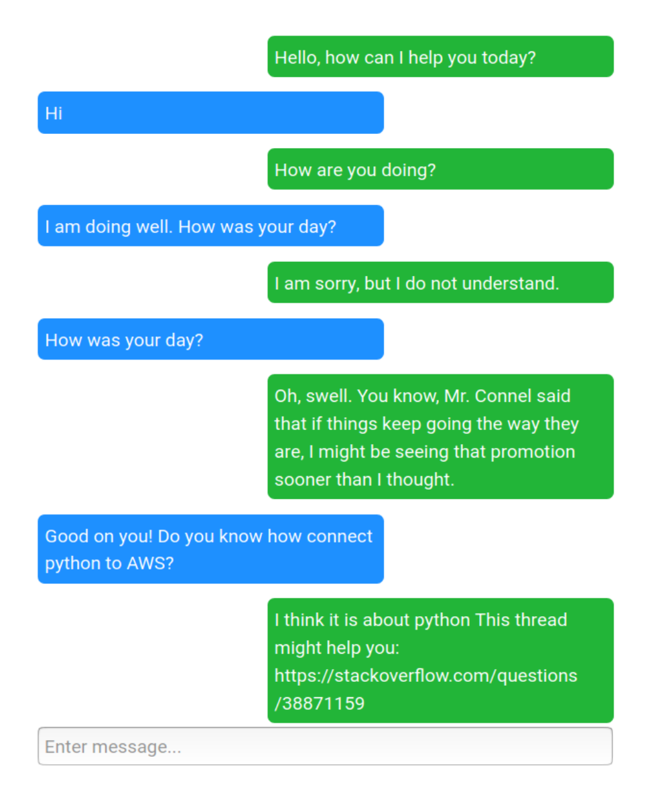

# Python conversational/goal oriented Chatbot

Goal-oriented chatbot that extracts software-related query from casual conversation and replies with a relevant link to stackoverflow. Original bot was deployed on AWS EC2. The bot supports a casual conversation, as well as a range of questions related to programming. The conversation may look something like this

Finding relevant stackoverflow threads is reasonably accurate, however there is a room for improvement in conversational part of the bot.

### Running the bot

The simplest way to run the bot is via Docker-Compose, simply `docker-compose up` in command line (use `docker-compose down --rmi all --remove-orphans` to clean everything up).  
To run the program using [Docker](https://www.docker.com/get-started) the following commands should be executed in the project folder 
`docker build -t fastapi_conda .` 
`docker run -p 5000:5000 -v $PWD/files:/home -t fastapi_conda` 

The bot is available in browser at `0.0.0.0:5000`.

The bot will download pre-trained files from Dropbox (moved from AWS S3), which may take some time, depending on the speed of internet connection. The total size of the files is 930 Mb.

### Under the Hood and room for improvements

Under the hood the bot uses [chatterbot](https://chatterbot.readthedocs.io/en/stable/) with embedding obtained using [Starspace](https://github.com/facebookresearch/StarSpace). Chatterbot a good starting point, but is quite constrained by a lack of context. Hence, a conversation follows follows a Markov model, where a reply generated by the bot is based on the maximum similarity between the last input by the user to a pre-recorded inputs in from the database. Although it is possible to enable bot to learn from the conversations with users (by updating the database), the feature is disabled by default.  
Future work will focused on keeping track of the context with the help of RNN. This will significantly enhance the conversational part of experience. 
